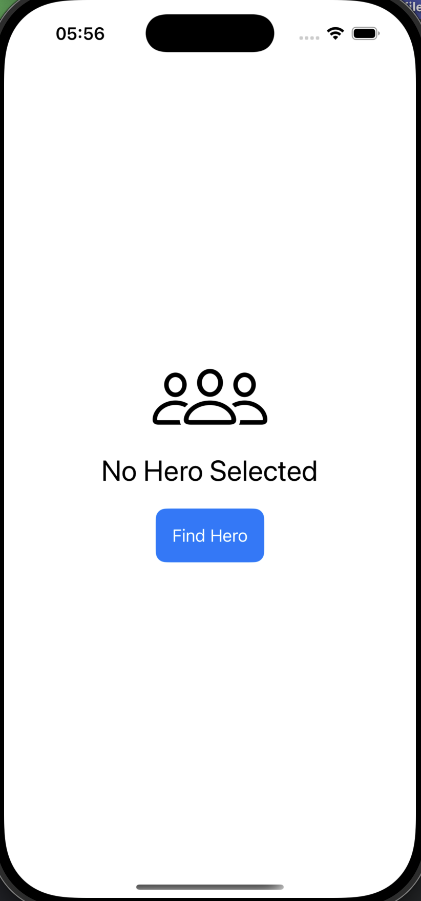
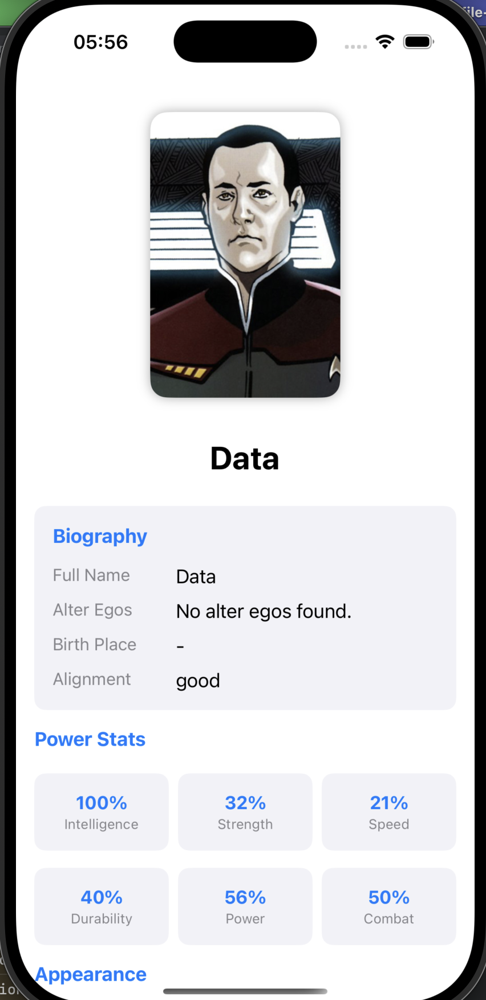
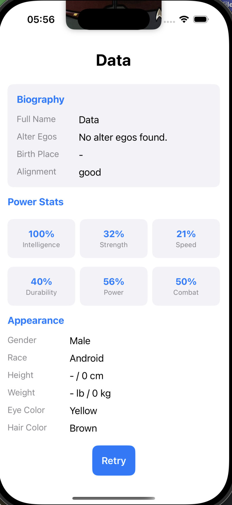

# HeroRandomizer

## 📌 Overview
HeroRandomizer is an iOS application that fetches and displays random superheroes from the **Superhero API**. It is designed to practice **UIKit project setup**, **SwiftUI integration**, **network requests**, **JSON parsing**, and **UI design**.

## 🚀 Features
- 🎲 **Random Superhero Generator** – Fetches a new hero on button press.
- 🦸 **Detailed Hero Information** – Displays at least 10 attributes (name, race, power stats, etc.).
- 🌐 **API Integration** – Uses the Superhero API to fetch hero data.
- 🎨 **Beautiful UI** – SwiftUI-powered layout inside UIKit.
- ⚡ **Smooth Transitions** – Enhances user experience with animations.

## 🌐 API Details
- **Base URL:** [Superhero API](https://akabab.github.io/superhero-api/)
- **Endpoint for all heroes:** [`https://akabab.github.io/superhero-api/api/all.json`](https://akabab.github.io/superhero-api/api/all.json)

## 🎯 Bonus Challenges (Optional)
- ⭐ **Save favorite superheroes** to a local database.
- 🔍 **Search function** to find specific heroes.
- 🎬 **Custom animations** when switching heroes.

## 📸 Screenshots  

  
  
  

